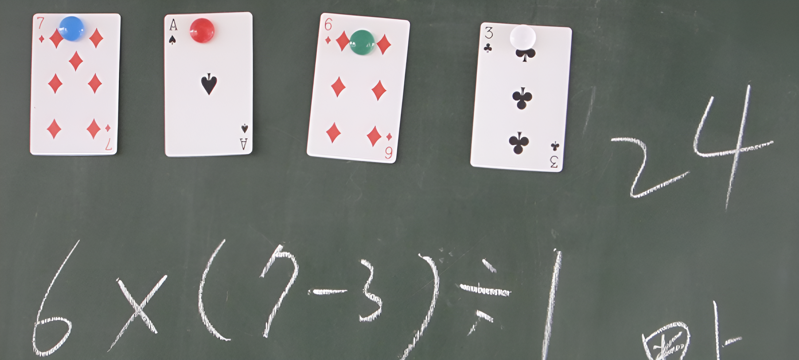
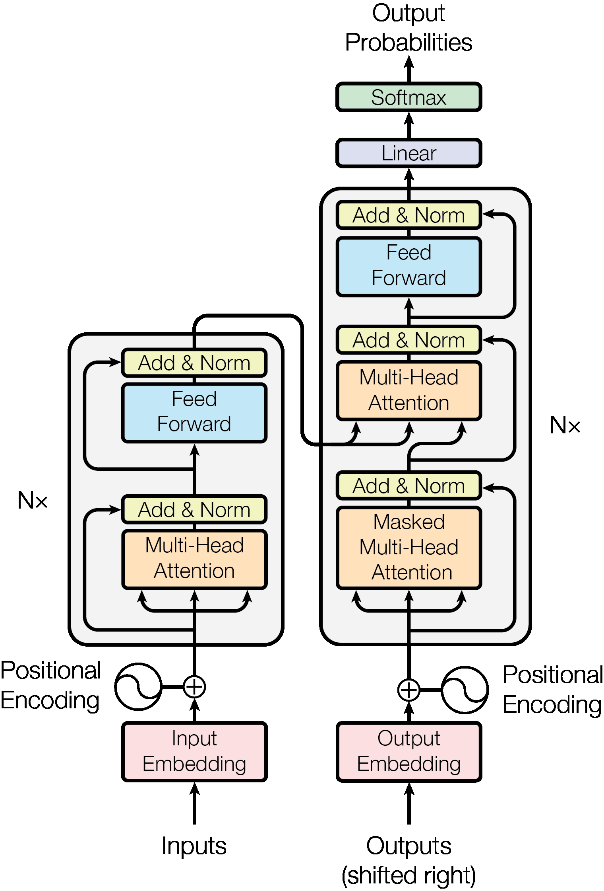
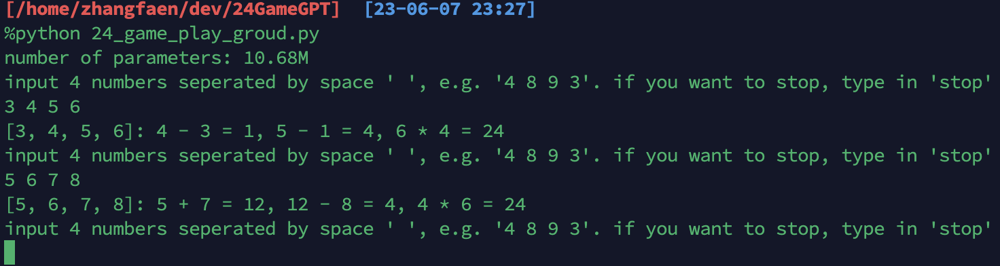

# GPT (Generative Pre-trained Transformer) for the 24 Game

## GPT (Generative Pre-trained Transformer) and Language Model
-------
This repository contains a PyTorch implementation of GPT, which includes both training and inference. GPT is a relatively simple model, as described in the `model.py` file. It takes a sequence of indices as input, applies a Transformer model (as described in the [Transformer paper](https://arxiv.org/abs/1706.03762)), and generates a probability distribution over the next index in the sequence.

Language modeling (LM) refers to the use of statistical and probabilistic techniques to determine the likelihood of a specific sequence of words occurring in a sentence. LM is often used for text generation tasks. The well-known ChatGPT, for example, takes a prompt as input and generates text to complete that prompt.

In this repository ([24GameGPT](https://github.com/zhangfaen/24GameGPT)), I have trained a GPT model specifically to solve the 24 Game.

A running demo:

**Note: This repo is for education purpose. The code is not performance optimized and maybe buggy. For those who want to learn Transformer and GPT LM. I recommend to use 'pdb' to follow any code that you are interested in.**

## 
欢迎关注我的微信订阅号"后向传播"： .  
这篇文章对应的订阅号链接：[从0训练一个生成式语言模型（GPT-LM）解24点游戏：ChatGPT背后的生成式语言大模型玩票级实现](https://mp.weixin.qq.com/s/OxvYXXYYbZq-WmgDRNgHYw)

## Some Background Information about the 24 Game
-------
The 24 Game involves using four numbers within the range of 0 to 9 and applying four different operators (+, -, *, /) to obtain a result of 24. For example, given the numbers 4, 2, 5, 3, there are multiple valid reasoning paths to achieve the desired result:

- [4, 2, 5, 3]: 5 - 2 = 3, 3 + 3 = 6, 6 * 4 = 24
- [4, 2, 5, 3]: 4 + 3 = 7, 5 + 7 = 12, 12 * 2 = 24
- ...
- [4, 2, 5, 3]: 5 + 3 = 8, 8 + 4 = 12, 12 * 2 = 24

I have trained a GPT model to predict these reasoning paths based on a given prompt (in the source code, the term "problem" is used to represent a prompt). The trained model takes a prompt like "[3, 7, 5, 5]: " as input, and we expect the model to output something like "7 + 5 = 12, 5 - 3 = 2, 2 * 12 = 24".

Since we are using a language model to solve the 24 Game, we treat "[3, 7, 5, 5]: 7 + 5 = 12, 5 - 3 = 2, 2 * 12 = 24" and "[3, 5, 5, 7]: 7 + 5 = 12, 5 - 3 = 2, 2 * 12 = 24" as different data samples.

I used 40% of all the data samples (refer to [24_game_data_generator.py](24_game_data_generator.py) for information on generating all possible data samples) to train the model.

The model achieved an accuracy of about 99.1% when evaluated on all data samples.

**Note:** For some combinations of numbers, there may not be a valid reasoning path to obtain 24. In such cases, the model may output nonsensical results. For example, given the numbers [3, 3, 8, 8], the model might output "3 * 8 = 24, 8 - 3 = 5, 24 / 1 = 24".

## Repository Structure
-------
- `24_game_data_generator.py`: Generates all possible data samples by enumerating the entire solution space.
- `24_game_all_data.txt`: Contains all generated data samples, totaling 323,188.
- `dataset.py`: Defines the dataset for `24_game_all_data.txt`.
- `model.py`: Defines the GPT model, including components like MultiHeadSelfAttention, Block, Transformer, etc.
- `utils.py`: Contains some useful tools.
- `trainer.py`: A utility tool for training the GPT model.
- `24_game_train.py`: The main script for training a GTP model to solve the 24 Game.
- `out/get24/4train-6test-6layer-6head-384emb-20000steps.model.pt`: A pre-trained 24 Game GTP model with approximately 10 million parameters.
- `24_game_play_groud.py`: Loads a pre-trained 24 Game GTP model and allows user input.

## Usage
-------
To use the pre-trained 24 Game GPT model, follow these steps:

1. Create a new Python environment: `conda create -n 24game python=3.10`
2. Activate the environment: `conda activate 24game`
3. Clone the repository: `git clone https://github.com/zhangfaen/24GameGPT.git`
4. Navigate to the repository directory: `cd 24GameGPT`
5. Install the required dependencies: `pip install -r requirements.txt`
6. Run the `24_game_play_groud.py` script: `python 24_game_play_groud.py`

That's it! The pre-trained 24 Game GPT model will be loaded, and you can provide your own inputs. For example, you can enter "4 3 3 4", and the model may generate a reasoning path based on your input prompt.

## Training a 24 Game GPT Model from Scratch
-------
To train a 24 Game GPT model from scratch, follow these steps:

1. Run the `24_game_data_generator.py` script: `python 24_game_data_generator.py` 
2. Run the `24_game_train.py` script: `python 24_game_train.py`

That's it! If you have a GPU, the training process will complete in a few minutes.

The default configuration for the Transformer model is as follows: 384 embedding dimensions, 6 heads, and 6 layers.

The default configuration for the trainer is as follows: 20,000 steps, batch size of 64, and 40% of all data samples used for training.

You can modify these hyperparameters and configurations in the [dataset.py](dataset.py) and [24_game_train.py](24_game_train.py) files.

**Note: The 1st step is optional, as I already put the data generated by this script in my repo.**

## References
-------
- [karpathy/nanoGPT](https://github.com/karpathy/nanoGPT)
- [openai/gpt-2](https://github.com/openai/gpt-2) (contains the model definition in TensorFlow but not the training code)
- [openai/image-gpt](https://github.com/openai/image-gpt) (includes some more modern modifications similar to GPT-3)
- [huggingface/transformers](https://github.com/huggingface/transformers) (provides a language modeling example)
- [Language modeling example](https://github.com/huggingface/transformers/tree/master/examples/pytorch/language-modeling) in the `transformers` repository

## Citation
-------
If you find this repository useful and want to cite it:

> Faen Zhang, 24GameGPT, GitHub, https://github.com/zhangfaen/24GameGPT